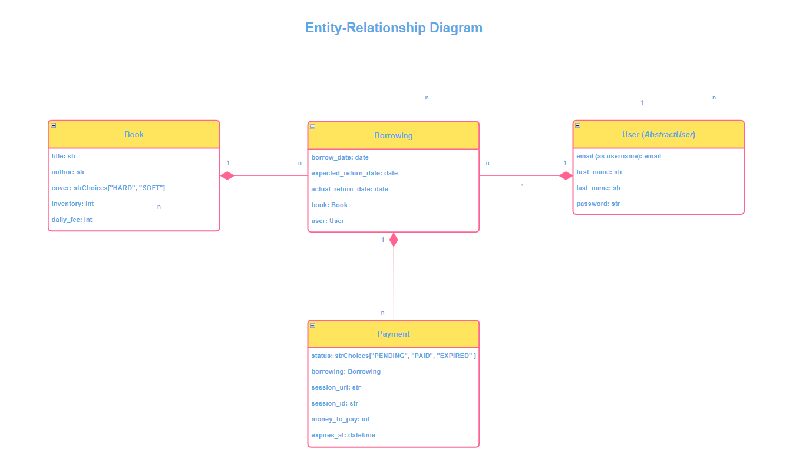
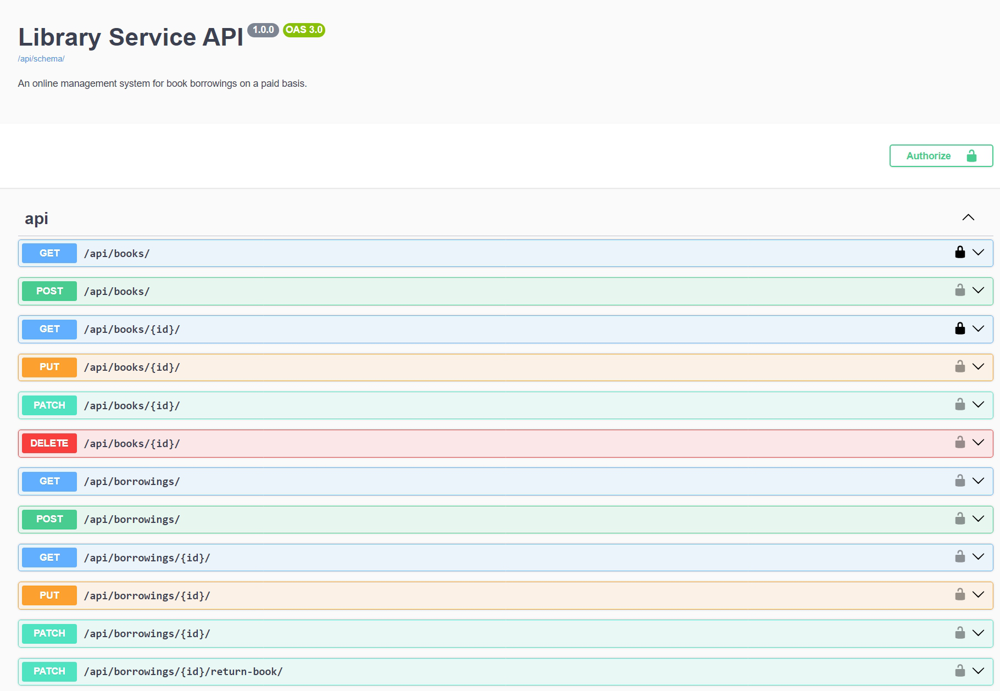
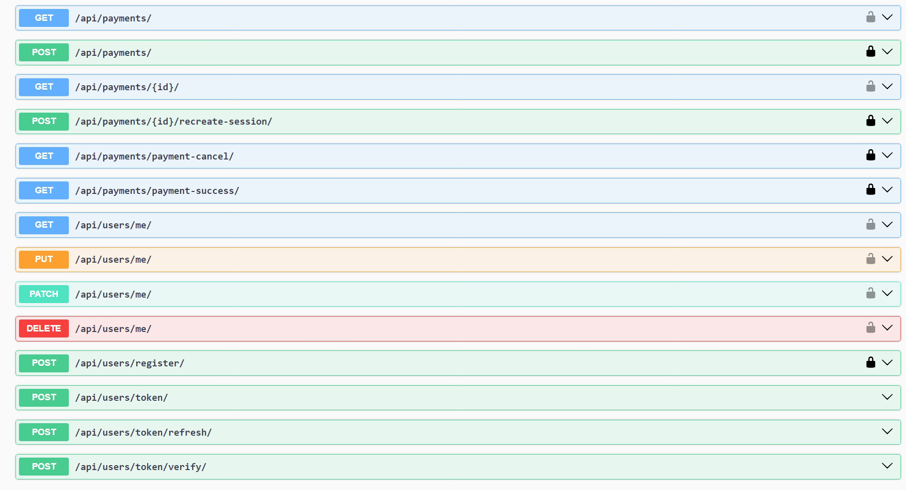

# Library Service API

Library Service API is overarching web application programming interface aimed to provide 
a diverse features and operations for managing the library. Its main goal is to make functioning
of the library more efficient by applying automation means.

All the API features are grouped by the following services (as stacks of homogenous functionalities).

## Book Service

Book Service is intended for managing book stock at the library, including creation of books and making
various operations with them. Nonetheless, only admin can create, update or delete books. Ordinary users 
have an access to a list of all books as well as to single book details without the possibility 
to make operations with them. 

## User Service

Users can register providing an email and a password. After going through authentication procedure users 
can view and update their profile information. 

## Borrowing Service

Borrowing Service operates the borrowing of books by users and provides all the necessary actions related 
to that functionality. 

* Create new borrowing: borrowing the book results in making the record in the ledger about borrowing
creation and corresponding changes of the inventory.
* Get borrowing collection - glean a list of borrowings based on 2 criteria:
  - user ID (for admin only);
  - "is_active" status for the borrowing (either the book is returned or not).
* Get certain borrowing: retrieve detailed information about specified borrowing information.
* Return the book: assign the value for "actual return date" of borrowed book. Simultaneously the payment 
for the borrowing is being created.

## Notification Service (Telegram chat)

Notification Service is in charge of sending notifications associated with library operations using 
Telegram chat.

* Keep library administrators informed about creation of new borrowing.
* Issue the alert on overdue borrowings.
* Notify administrators about successful payments.

## Payment Service (Stripe API integration)

Payment Service provides payment processing for borrowings in reliable and secure way using 
Stripe payment gateway.

* Perform payments for borrowings: deliver full-fledged financial infrastructure to users 
for making payments.
* Checking payment processing status: verify that the payment has been processed successfully
or inform about payment cancellation.
* Ensures the control of expiration time for the payments session and for the payment.

## Installation

Clone this repository:

   ```bash
   git clone https://github.com/callogan/library-service-api
   cd library-service-api
   ```

* The main branch is considered as the most sustainable branch, therefore it is recommended to work from it.

* If you intend to run the application locally, follow the next steps:

1. Create the virtual environment:

   ```bash
   python -m venv venv
   ```

2. Activate the virtual environment:

   On Windows:

      ```bash
      venv\Scripts\activate
      ```

   On macOS and Linux:

      ```bash
      source venv/bin/activate
      ```

3. Install dependencies:

   ```bash
   pip install -r requirements.txt
   ```

4. Copy this file ".env.sample" and rename it to ".env", then fill in the actual values for your local environment.

STRIPE_API_KEY (as secret key) is available here: https://sripe.com/. You can get Telegram Bot Token 
here: https://t.me/BotFather. 

5. Apply the migrations:

   ```bash
   python manage.py migrate
   ```

6. In order to run the development server, use the following command:

   ```bash
   python manage.py runserver
   ```

* You might as well run the application via the Docker. For this purpose make certain the Docker is installed 
on your computer and follow the next steps:
1. Fill the actual data for ".env" file (as was mentioned above).
2. Build the Docker image and start the containers for the application and the database:
   ```bash
   docker-compose up --build
   ```

Access the application in your web browser at http://localhost:8000.

## Project Fixture

 - This project includes the fixture that is used for demonstration purpose. The fixture contains basic dataset
representing various project entities.
 - The fixture named `library_service_db_data.json` is located in the root directory.
 - In order to load the fixture data into the application, use the following command:

   ```bash
   python manage.py loaddata library_service_db_data.json
   ```

## Technologies
   
* [Django REST Framework](https://www.django-rest-framework.org/) This is toolbox for designing Web APIs, providing 
features such as serialization, authentication, API views and viewsets to streamline the development of RESTful services
in Django applications.
* [Celery](https://docs.celeryq.dev/en/stable/) This is the system to operate task queue with focus on real-time 
processing and option to schedule tasks.    
* [Redis](https://redis.io/) This is a source available, im-memory storage, used as distributed, in-memory key-value 
database, cache and message broker.
* [Docker](https://www.docker.com/) This is open source containerization platform that enables developers to package 
applications into containers, simplifying the process of building, running, managing and distributing applications 
throughout different execution environments.
* [PostgreSQL](https://www.postgresql.org/) This is a powerful, open source object-relational database management 
system.
* [Swagger](https://swagger.io/) This is open source suite of tools to generate API documentation.

## Demo





## Copyright

Copyright (c) 2024 Ruslan Kazmiryk
